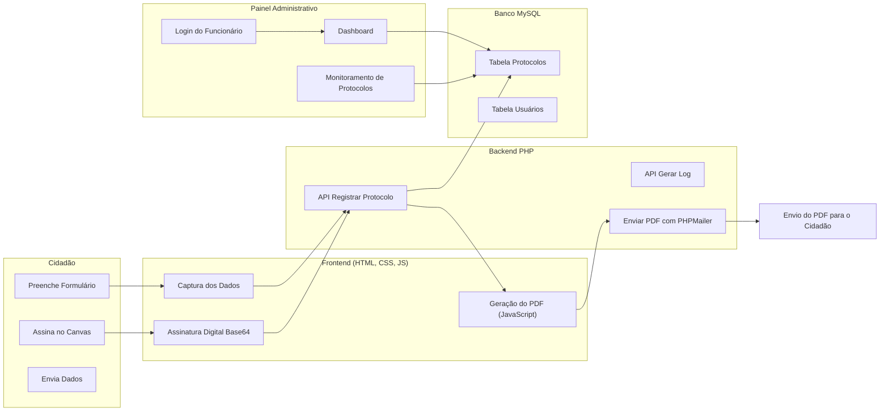

# 🏛️ Protocolo de Entrega – Sistema de Atendimento da Prefeitura de Guaíba

---

Este repositório contém o sistema **Protocolo de Entrega**, desenvolvido para a Prefeitura de Guaíba com o objetivo de registrar atendimentos, gerar comprovantes oficiais e organizar toda a entrega de itens aos cidadãos. O sistema permite que o atendido insira seus dados, gere um protocolo em PDF e receba automaticamente uma cópia por e-mail.

O projeto foi criado inteiramente utilizando **Google AI Studio**, **Gemini 3 Pro** e desenvolvido/refinado na **IDE Antigravity**, garantindo agilidade, padronização e uma construção totalmente orientada a prompts.

---

## 🎯 Objetivo do Sistema

- Registrar informações de cidadãos atendidos  
- Gerar um **protocolo oficial de entrega** em PDF  
- Enviar automaticamente uma cópia do protocolo por e-mail  
- Registrar todos os protocolos no banco MySQL  
- Permitir que administradores monitorem atendimentos, datas, itens entregues e usuários responsáveis  

---

## 🚀 Funcionalidades Principais

### 📝 **Área do Cidadão**
- Inserção de:
  - Nome completo  
  - CPF ou matrícula  
  - E-mail  
  - Lista de itens entregues  
- Captura de **assinatura digital** via canvas (Base64)  
- Geração automática do PDF com todos os dados  
- Envio do PDF ao e-mail informado via **PHPMailer**  
- Registro completo no banco de dados  

---

### 🖥️ **Área Administrativa**
- Login para usuários autorizados  
- Visualização de todos os protocolos registrados  
- Listagem com:
  - Nome do atendido  
  - Data e hora  
  - Usuário responsável  
  - Itens entregues  
- Ferramentas de auditoria e monitoramento interno  

---

## 🛠 Tecnologias Utilizadas

### **Frontend**
- HTML5  
- CSS3  
- JavaScript  
- Canvas Base64 para assinatura digital  
- Geração de PDF via JavaScript  

### **Backend**
- PHP  
- MySQL  
- PHPMailer  
- API interna para gravação de registros  

### **Ferramentas de Desenvolvimento**
- Google AI Studio  
- Gemini 3 Pro  
- Antigravity IDE  
- Git & GitHub  

---

## 📁 Estrutura Geral do Projeto
/
├─ public/

│ ├─ index.html

│ ├─ form/

│ ├─ js/

│ ├─ css/

│ └─ pdf/

│

├─ backend/

│ ├─ conexao.php

│ ├─ registrar_protocolo.php

│ ├─ enviar_email.php

│ ├─ phpmailer/

│ └─ admin/

│ ├─ login.php

│ ├─ dashboard.php

│ └─ protocolos.php

│

└─ README.md

---

## 🔐 Segurança

- PDF com assinatura digital Base64  
- Banco MySQL com registro completo das ações  
- Separação entre área pública e administrativa  
- Sistema de auditoria interna  
- Controle de usuários responsáveis pelas entregas  

---

## 🧩 Arquitetura do Sistema

## 🧑‍💻 Autor

**Ricardo Quadros**  
Estudante de Engenharia da Computação na UERGS
Técnico em Informática na Dr. Solon Tavares 
Estagiário de Tecnologia e Informação – Prefeitura de Guaíba
Guaíba, RS – Brasil

---

## 📫 Contato

- GitHub: https://github.com/ricardaoquadros-jpg
- Email: ricardaoquadros@gmail.com
- Linkedin: https://www.linkedin.com/in/ricardopquadros/
****
